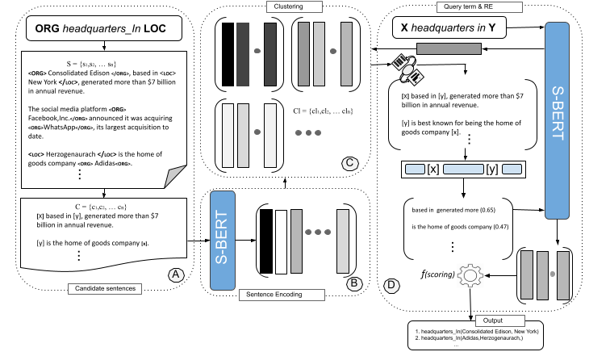
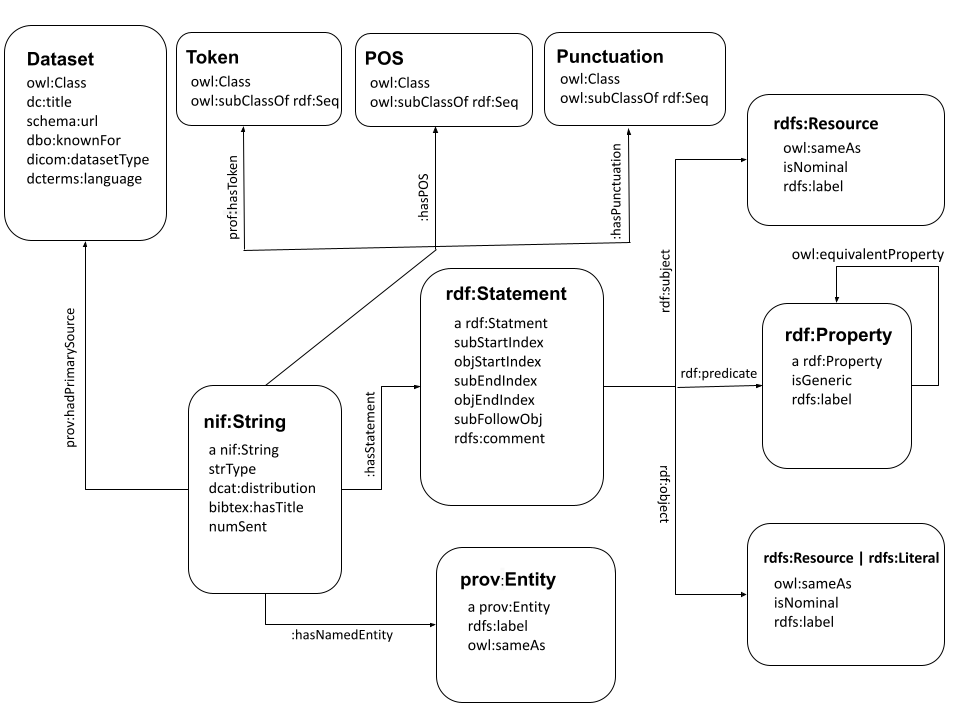

# Annual Performance and Achievements Report

## Introduction

This document provides an overview of my performance, achievements, and contributions over the past year. It highlights the projects I've been involved in, papers I have written, key accomplishments, challenges overcome, and skills developed.

## Overview of the Past Year

- **Projects**: Over the past year, I have actively contributed to three significant projects: **KISA**, **RELD**, and **SPARQL Embeddings**.
- **Responsibilities**: In the context of the KISA/KIAM project, my primary role was focused on the development aspect. I took full ownership of the RELD project, overseeing its entire lifecycle from conceptualization to successful implementation and eventual acceptance. Additionally, I played a pivotal role in the SPARQL Embeddings project, where my responsibility encompassed the thorough implementation of a transformer-based encoder.

## Achievements

### 1. Projects

#### Project A: KISA

- Effectively executed the implementation of its online API in advance of the projected timeline, leading to the creation of https://kisaa-ir.cs.upb.de/api/.
- Additionally, accomplished the training of a re-ranker for information retrieval.
- Currently, the project is progressing ahead of schedule.
- Collaborated closely with the KISA/KIAM team to optimize and enhance operational workflows.

#### Skill Development

- Gained proficiency in semantic search methodologies.
- Acquired knowledge of various techniques related to indexing:
    - Nearest Neighbor Search (ANN) employing FAISS, accessible at:  [https://github.com/facebookresearch/faiss](https://github.com/facebookresearch/faiss)
    - Proficiently utilized Elastic search for indexing purposes.
    - Applied Nearest Neighbor Search (ANN) using Annoy, available at: [https://github.com/spotify/annoy](https://github.com/spotify/annoy)
    - Employed Nearest Neighbor Search (ANN) through Hnswlib, accessible at: [https://github.com/nmslib/hnswlib/](https://github.com/nmslib/hnswlib/)
- Successfully completed a comprehensive information retrieval course on YouTube, aimed at deepening my understanding of the subject.
#### Project B: RELD
- Succefully completed the RELD (Relation Extraction Linked Data) project:
    - [GitHub Repository](https://github.com/dice-group/RELD)
    - [Documentation](https://manzoorali29.github.io/index.htm)
    - [Online](http://reld.cs.upb.de:8890/sparql)
    - [Paper](https://papers.dice-research.org/2023/RELD/public.pdf)
#### Skill Development
- Explored semantic web related technologies
- RDFLib library
- RDFize open-source relation extraction datasets
- Created a unified schema

#### Project C: SPARQL Embeddings
- My task was to implement a transformer based encoder for the already generated embeddings
- I have implemented the encoder
#### Skill Development
- Learns working in Pytorch

### 2. Papers
#### Paper A: [SURE](https://papers.dice-research.org/2022/ICSC_SURE/public.pdf) Unsupervised Relation Extraction with Sentence level Distributional Semantics
- The paper was accepted at ICSC 2023 and was successfully presented.
- Code [GitHub Repo](https://github.com/manzoorali29/SURE)
  

#### Paper B: [RELD](https://papers.dice-research.org/2023/RELD/public.pdf) A Knowledge Graph of Relation Extraction Datasets
- The paper was accepted at ESWC 2023 and was successfully presented. The paper received appreciation from the relevant community.
- Code [GitHub Repo](https://github.com/dice-group/RELD) 
  
## Challenges and Solutions

- Overcame challenges in [situation], utilizing [strategy or approach] to achieve [positive outcome].
- Demonstrated adaptability by effectively managing [challenge] during [project], resulting in [benefit or lesson learned].

## Collaborations

- Collaborated with [team/colleague] to [achieve collaborative outcome].
- Contributed to cross-functional teams by providing [specific contribution], which led to [positive impact].

## Feedback and Improvements

- Received positive feedback from [supervisor/colleague/client] for [specific action], confirming my dedication to quality work.
- Acted on constructive feedback by [specific improvement], resulting in [better outcome or performance].

## Future Goals

- Look forward to contributing to [upcoming project/initiative] by [specific goal].
- Aim to further develop [specific skill] and explore opportunities for [future growth area].

## Conclusion

I am proud of the achievements and growth I've experienced over the past year. As I look ahead, I am committed to continuing my efforts to contribute positively to [team/department/organization] and further elevate my performance.

Thank you for your support and guidance.

Sincerely,
[Your Name]
[Your Title]
[Contact Information]
